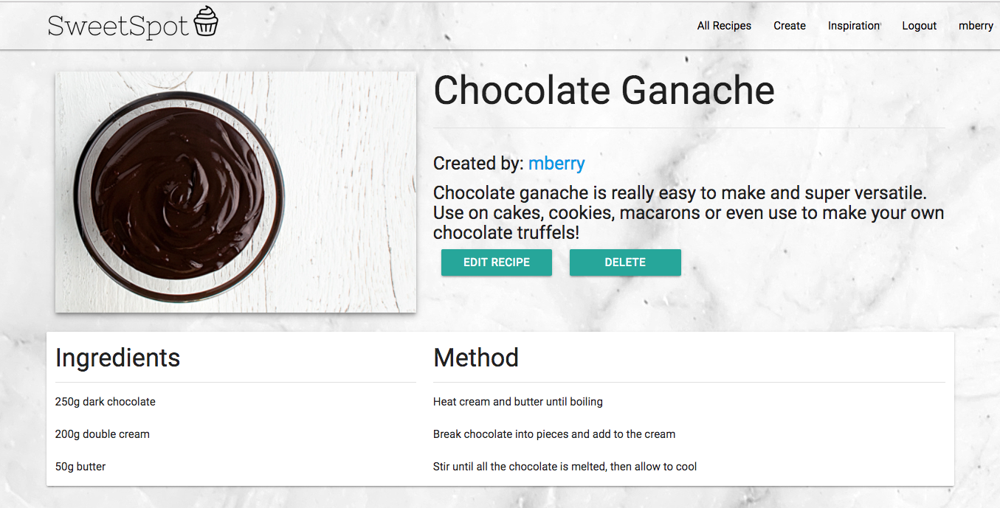
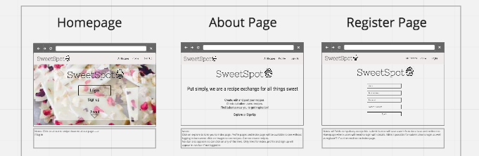
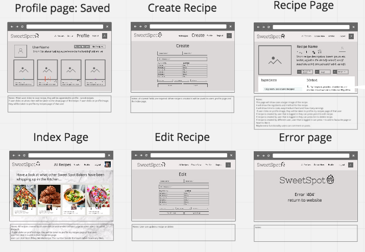
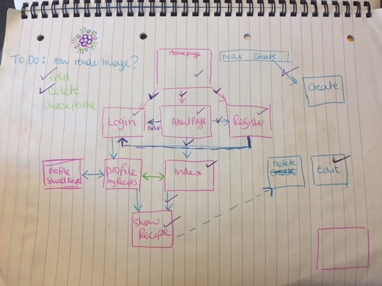

# Sweet Spot Recipe Exchange

</img>

## Introduction
This was my first full stack web application in which I made an authenticated RESTful app using Node.js, Express, EJS and MongoDB. I found this project the most difficult because, as well as the coding languages being a new skill, the concept of implementing multiple interconnecting files was also new.

Click <a href="https://warm-oasis-10599.herokuapp.com/">here</a> to have a look at my website.

## Objectives

The objectives of this project were:

1) Create an authenticated app
2) Create an MVC RESTful app using express, EJS and Node.js
3) Use a NoSQL database
4) Style using a CSS framework

I love to bake and keep all these recipes hand written in a big book stained with chocolate. I cant carry this around with me so often find myself away from home and unable to bake my favourite classics. I also have friends who bake and we often exchange recipes over Facebook or email. I decided to put all this together in an app where I can write my recipes to access from anywhere and also exchange with friends. So based on the criteria above I thought this would be a great opportunity to create a recipe exchange site.

## Planning

I initially drew the wireframes on paper. I then found an application that I liked to create more detailed wireframes. I decided to use realtimeboard as I liked the flexibility and how simple it was to use. I then transferred the basic hand drawn layouts onto realtimeboard to give more detailed frames.

</img>
</img>

After the wireframing I created a flow diagram for how the pages would interconnect and what RESTful actions were necessary.

</img>

Finally I wrote out a to-do list so that I could check off tasks as and when I had implemented them.

## Development

First I had to set up Express for my app. To do this I created the package.json file through npm in terminal and then installed Express. I then created the index.js file in order to require the necessary and useful modules (eg. morgan, bodyParser etc.), connect to the mongo database, setup the middleware and use the routes.

For this project I used EJS to create views for each page of the website. So in the index.js I set up the express app by indicating where to find the views and that I was going to use the ejs template language.

```
const app = express();
app.set('view engine', 'ejs');
app.set('views', `${__dirname}/views`);
```

In order to make my code as DRY as possible I used express-ejs-layouts so that anything consistent on every page could be put in the layout.ejs eg. the <head>, the navbar, the scripts etc. I also used partials so that I could make the code more modular and included these partials using the syntax
``<% include ./partials/navbar %>``
I also used routes.js file in order to render the correct views using Express RESTful routes so that when a request for /recipes is made for instance, the recipes index page will show.

I used the ORM mongoose to make it easier "talk" to the MongoDB with Node.js. After requiring Mongoose in the models I created 2 schemas: Users and Recipes. In order to allow the user to register, login and update their profile and after logging in to create, read, update and delete recipes I used an MVC structure. The controller receives the request, the model retrieves the information from the database and the view prints the information for the client to see.

In order to set up authentication I used Bcrypt and sessions and roughly followed the same MVC model although it does not use 1 of the 7 RESTful routes.

The middleware in the index.js checks that the user is logged in and prevents them from seeing certain data unless they are logged in.

```
app.use((req, res, next) => {
  console.log(req.session.userId);
  if (!req.session.userId) return next();

  User
    .findById(req.session.userId)
    .exec()
    .then((user) => {
      if(!user) {
        return req.session.regenerate(() => {
          req.flash('danger', 'You must be logged in.');
          res.redirect('/');
        });
      }

      // Re-assign the session id for good measure
      req.session.userId = user._id;
      req.user = user;
      res.locals.loggedInUser = user;
      res.locals.isLoggedIn = true;

      next();
    });
});

```

I used both referenced and embedded resources in this project. As you can see in the code below I have used an embedded model for the comments and a referenced model for the createdBy.

```
const commentSchema = new mongoose.Schema({
  body: String,
  user: { type: mongoose.Schema.ObjectId, ref: 'User'}
});

const recipeSchema = new mongoose.Schema({
  name: { type: String, required: true},
  image: [{type: String}],
  description: { type: String},
  ingredient1: { type: String},
  ingredient2: { type: String},
  ingredient3: { type: String},
  ingredient4: { type: String},
  ingredient5: { type: String},
  ingredient6: { type: String},
  step1: { type: String},
  step2: { type: String},
  step3: { type: String},
  step4: { type: String},
  step5: { type: String},
  step6: { type: String},
  comments: [commentSchema],
  createdBy: {type: mongoose.Schema.ObjectId, ref: 'User'}
});

```
Finally I used Materialize css framework to help style the website. This was my first experience using Materialize. I was able to develop a website that was close to how I had wireframed it. In my next project I would like to try using another framework to expand my knowledge and also see what might be my favourite to work with.


## Future Improvements
The main thing that I would like to do with this app is to improve the design and layout. A few other things that I think would improve the site would be to add some options when creating the recipe to choose number of portions, cook time and how easy it is to make. I would also allow the user to add as many lines of method/ingredients as they like instead of just upto 6 which i have at the moment. The final thing I would add is nutritional values so that when a recipe is created, the nutritional values would automatically be generated.
